# WEFUNK Dashboard

> **Explore decades of WEFUNK Radio playlists alongside your own music
> library.**

*Transforming playlists into a living music knowledge base.*

------------------------------------------------------------------------

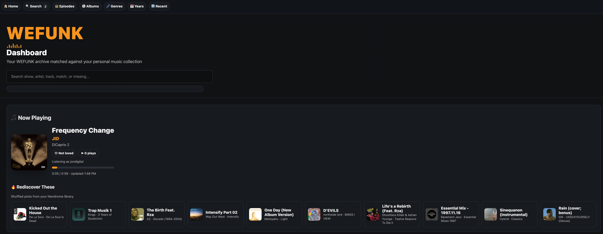

## Highlights

-   🎵 Intelligent matching against your personal music library
-   📚 Browse WEFUNK episodes, artists, albums, genres, and years
-   🧠 Fuzzy artist and title matching with metadata normalization
-   📊 Collection statistics and missing-track analysis
-   🖼️ Album, artist, and episode artwork support
-   ▶️ Optional Navidrome play-count and now-playing integration
-   🔎 Fast client-side search
-   🚀 Static dashboard generation
-   ⚙️ Portable environment-based configuration

## Screenshots

### Homepage

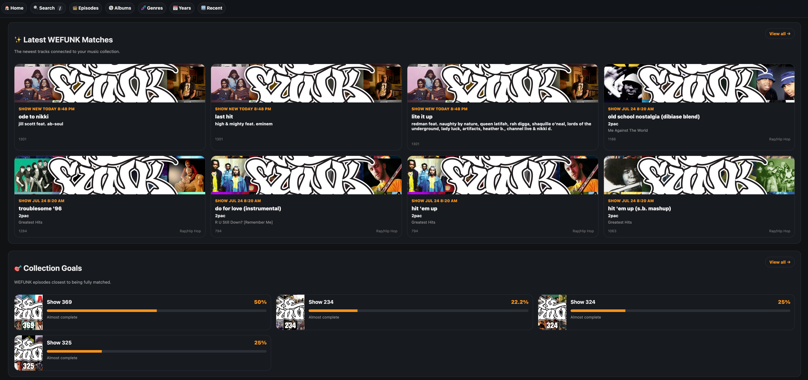

### Episode Browser

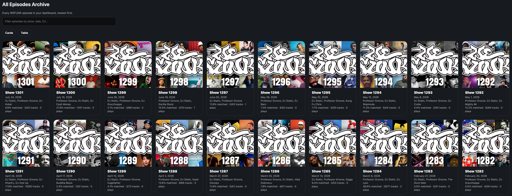

### Artist Pages

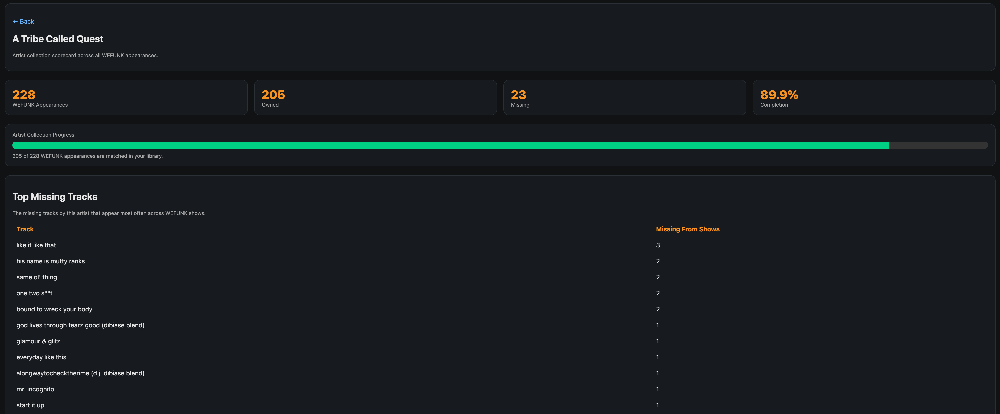

### Album Index

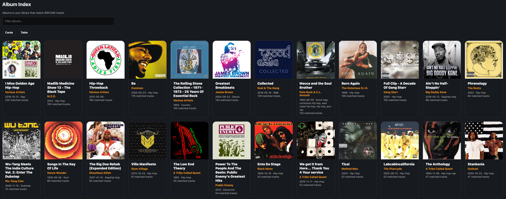

### Album Page

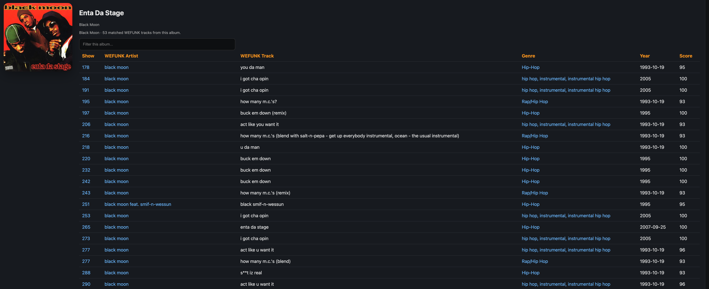

### Genre Index

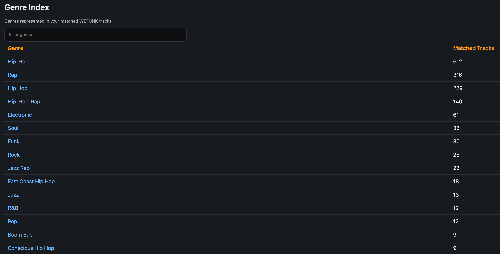

### Search

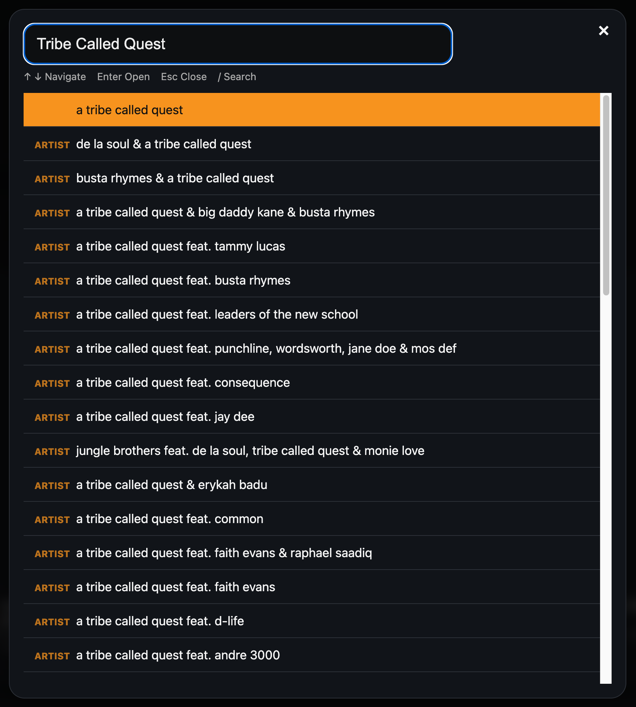

### Collection Goals

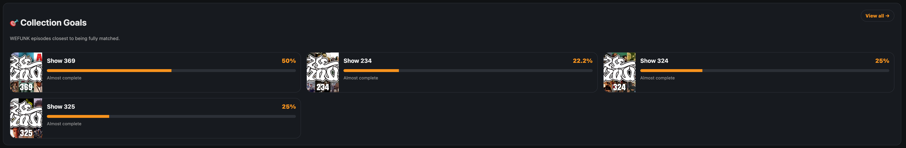

### Statistics

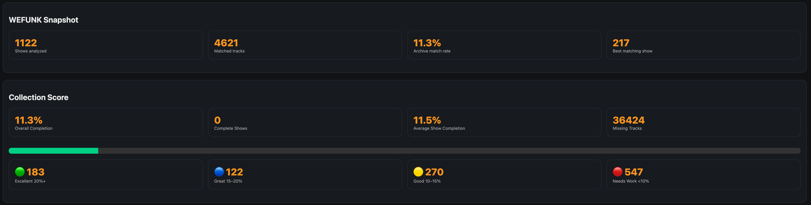

### Reports

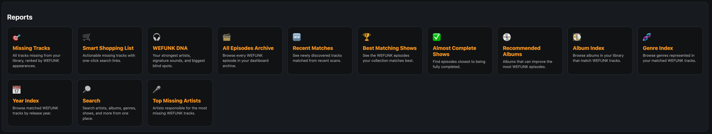

### WEFUNK DNA

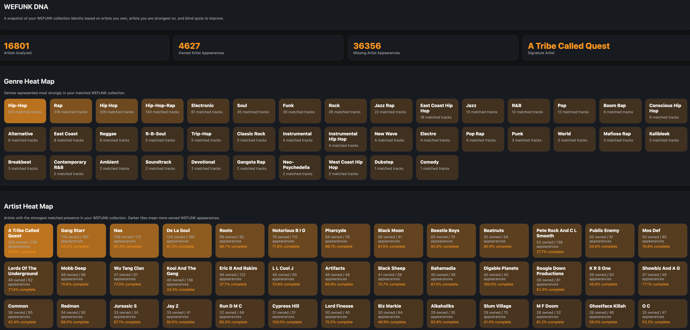

## How It Works

``` text
WEFUNK playlist metadata
        │
        ▼
Import / database engine
        │
        ▼
Local music-library matching
        │
        ▼
Metadata and genre enrichment
        │
        ▼
Artwork / play-count processing
        │
        ▼
Dashboard generator
        │
        ▼
Static website
```

Each stage enriches the previous one while keeping runtime data separate
from the application source.

The generated site can be served locally or placed behind a normal web
server or reverse proxy.

## Requirements

WEFUNK Dashboard is currently developed and tested primarily on
**macOS**. Much of the Python code should also be portable to Linux, but
the included shell helpers and some optional integrations are
macOS-oriented.

You will need:

-   Python 3.14+
-   A local music library
-   WEFUNK playlist metadata in JSON format
-   SQLite support, included with standard Python installations

Optional integrations include:

-   Navidrome
-   An external WEFUNK episode downloader
-   An external WEFUNK playlist scraper

## Installation

Clone or download the repository, then create a Python virtual
environment:

``` bash
python3 -m venv .venv
.venv/bin/python -m pip install --upgrade pip
.venv/bin/python -m pip install -r requirements.txt
```

Create your local configuration:

``` bash
cp .env.example .env
```

Edit `.env` and set the paths appropriate for your system.

At minimum, review:

``` text
WEFUNK_DATA_DIR
WEFUNK_MUSIC_DIR
WEFUNK_EPISODE_DIR
WEFUNK_SITE_DIR
```

If you use Navidrome, also configure:

``` text
ND_URL
ND_USER
ND_PASS
```

Your real `.env` file is ignored by Git and should never be committed.

## First-Run Check

After installing dependencies and configuring `.env`, run:

``` bash
./bin/wefunk-init
```

The first-run check:

-   creates the runtime directory structure;
-   verifies the Python environment and required packages;
-   checks your configured music directory;
-   checks for WEFUNK metadata;
-   checks for required databases;
-   reports what still needs to be configured.

It does not perform a full music-library scan.

A new installation may initially report that WEFUNK metadata and
databases are missing. Add playlist JSON data to:

``` text
$WEFUNK_DATA_DIR/json
```

or configure the optional scraper:

``` text
WEFUNK_SCRAPER_SCRIPT=/path/to/scraper
```

Once the required source data is available, run a full scan.

## Main Workflow

### Full scan

``` bash
./bin/wefunk-scan
```

The full scan runs the WEFUNK engine, synchronizes optional Navidrome
play counts, attempts artist-image synchronization, and safely rebuilds
the dashboard.

### Incremental update

After the initial library index exists:

``` bash
./bin/wefunk-update
```

This updates WEFUNK data using the existing library index and rebuilds
the dashboard.

### Rebuild only

To rebuild the dashboard from the existing databases and exports:

``` bash
./bin/wefunk-dashboard
```

### Serve locally

Start the included dashboard server:

``` bash
./wefunk-dashboard/run-dashboard.sh
```

The default local address is:

``` text
http://localhost:8099
```

Open the configured dashboard URL with:

``` bash
./bin/wefunk-dashboard-open
```

The Flask application also exposes:

``` text
/health
```

for a simple HTTP health check.

## Command-Line Helpers

  -----------------------------------------------------------------------
  Command                             Purpose
  ----------------------------------- -----------------------------------
  `./bin/wefunk-init`                 Validate a new installation and
                                      create runtime directories

  `./bin/wefunk-scan`                 Run a full WEFUNK/library scan and
                                      dashboard rebuild

  `./bin/wefunk-update`               Run an incremental update using the
                                      existing library index

  `./bin/wefunk-sync`                 Sync Navidrome play counts and
                                      rebuild

  `./bin/wefunk-dashboard`            Safely rebuild the generated
                                      dashboard

  `./bin/wefunk-dashboard-health`     Check whether generated dashboard
                                      output exists

  `./bin/wefunk-dashboard-open`       Open the configured dashboard URL

  `./bin/wefunk-dashboard-steps`      Display the dashboard build
                                      pipeline

  `./bin/wefunk-check-scripts`        Display key project script
                                      locations

  `./bin/wefunk-album-art`            Download missing album artwork and
                                      rebuild

  `./bin/wefunk-art`                  Download WEFUNK episode artwork

  `./bin/wefunk-download`             Run the optional external
                                      episode-download workflow

  `./bin/wefunk-nowplaying`           Export current Navidrome
                                      now-playing data

  `./bin/wefunk-nowplaying-status`    Inspect now-playing state on macOS

  `./bin/wefunk-weekly`               Run the optional download, artwork,
                                      and update workflow
  -----------------------------------------------------------------------

## Configuration

Configuration is controlled through environment variables.

The included `.env.example` documents the available settings. Values
supplied by the operating environment take precedence over values in the
project-local `.env`.

### Runtime data

`WEFUNK_DATA_DIR` is the runtime data root.

Default:

``` text
~/.local/share/wefunk
```

Runtime data may include:

``` text
db/
exports/
json/
artwork/
playlists/
state/
timing-cache/
```

### Music library

`WEFUNK_MUSIC_DIR` points to your main music library.

Default:

``` text
~/Music
```

### WEFUNK episodes

`WEFUNK_EPISODE_DIR` points to downloaded WEFUNK episode audio.

Default:

``` text
$WEFUNK_MUSIC_DIR/wefunkradio mixes
```

### Generated site

`WEFUNK_SITE_DIR` controls the generated dashboard location.

Default:

``` text
<project>/site
```

### Database and exports

The normal defaults are:

``` text
WEFUNK_DB_FILE=$WEFUNK_DATA_DIR/db/wefunk.db
WEFUNK_EXPORT_DIR=$WEFUNK_DATA_DIR/exports
```

Both can be overridden independently.

### Dashboard server

The default local port is:

``` text
WEFUNK_PORT=8099
```

Set `WEFUNK_PUBLIC_URL` if the dashboard is available through an
external URL or reverse proxy.

### Navidrome

Optional Navidrome integration uses:

``` text
ND_URL
ND_USER
ND_PASS
```

Navidrome is used by play-count and now-playing features.

### Advanced overrides

Advanced configuration can override locations such as:

``` text
WEFUNK_PROJECT_ROOT
WEFUNK_VENV
WEFUNK_PYTHON
WEFUNK_ENGINE_SCRIPT
WEFUNK_MATCHER_SCRIPT
WEFUNK_BUILD_STEPS
WEFUNK_SITE_NEXT_DIR
WEFUNK_SITE_BACKUP_DIR
WEFUNK_LOG_DIR
```

See `.env.example` for details.

## Project Structure

``` text
wefunk-dashboard/
├── .env.example
├── .gitattributes
├── .gitignore
├── README.md
├── requirements.txt
├── bin/
│   └── command-line helpers
├── docs/
│   └── screenshots and documentation assets
├── engine/
│   └── matching, database, and library-processing modules
├── generators/
├── render/
├── wefunk-dashboard/
│   └── dashboard generators, Flask app, and build pipeline
└── wefunk-engine/
    └── standalone WEFUNK processing engine
```

Runtime and generated data are intentionally kept outside the tracked
source.

## Safe Dashboard Builds

`./bin/wefunk-dashboard` builds a new site in a staging directory before
replacing the current generated site.

Conceptually:

``` text
site-next
    │
    │ build succeeds
    ▼
  site
```

Before replacement, the previous generated site can be retained as:

``` text
site-backup-last-good
```

The staging site, generated site, and local backup are excluded from
version control.

## WEFUNK Metadata

WEFUNK Dashboard expects playlist metadata in JSON format under:

``` text
$WEFUNK_DATA_DIR/json
```

Playlist metadata can be collected using an external WEFUNK playlist
scraper.

The optional setting:

``` text
WEFUNK_SCRAPER_SCRIPT
```

can point to a scraper used by metadata-refresh workflows.

## Optional Episode Downloads

The project can integrate with an external WEFUNK episode downloader.

Configure:

``` text
WEFUNK_DOWNLOADER_DIR=/path/to/downloader
```

and run:

``` bash
./bin/wefunk-download
```

This integration is optional. It is not required when you already have
the WEFUNK metadata and audio needed for your workflow.

## Artwork

WEFUNK Dashboard contains tools for processing episode, album, and
artist artwork.

Useful helpers include:

``` bash
./bin/wefunk-art
./bin/wefunk-album-art
```

Some artist-image workflows use external services such as MusicBrainz
and may require network access.

## Generated Dashboard

The build pipeline generates a static dashboard containing HTML, CSS,
JavaScript, images, JSON assets, and client-side search data.

The generated `site/` directory is not committed to the repository by
default.

The repository also includes a small Flask/Waitress application for
serving the generated site locally.

## Privacy and Local Data

WEFUNK Dashboard is designed so personal library data and credentials
remain outside the source repository.

The default `.gitignore` excludes items such as:

-   `.env`;
-   Python virtual environments;
-   generated dashboard output;
-   runtime databases;
-   CSV exports;
-   logs;
-   reports;
-   backups;
-   runtime playback state;
-   generated artwork caches.

Before publishing your own fork, always review the files selected for
commit and make sure they do not contain credentials, private URLs,
personal filesystem paths, or music-library data.

## Development Checks

### Python syntax

``` bash
find . \
  -type f \
  -name '*.py' \
  -not -path './.venv/*' \
  -not -path '*/__pycache__/*' \
  -print0 |
while IFS= read -r -d '' f; do
  .venv/bin/python -m py_compile "$f" || exit 1
done
```

### Shell syntax

``` bash
find bin wefunk-dashboard \
  -type f \
  -print0 |
while IFS= read -r -d '' f; do
  head -1 "$f" | grep -qE '^#!.*(zsh|bash|sh)' || continue
  zsh -n "$f" || exit 1
done
```

## Contributing

Contributions are welcome.

Please:

-   keep changes focused;
-   avoid committing generated or personal data;
-   never commit credentials;
-   avoid machine-specific paths in source;
-   run Python and shell syntax checks;
-   test against isolated runtime directories when practical.

## License

A project license has not yet been selected.

## Acknowledgements

WEFUNK Dashboard exists because of the remarkable work of **WEFUNK
Radio** and its decades-long commitment to sharing exceptional music.

This project is an independent companion created to help listeners
explore, organize, and rediscover the artists, albums, tracks, and
musical history represented throughout the WEFUNK archive.

### WEFUNK Downloader

The `evanslynk/wefunkdownloader` project provides tooling for
downloading and preserving WEFUNK Radio episodes and can be used as an
optional external integration.

### WEFUNK Playlist Downloader

The `gmg77/wefunk_pl` project provides tooling for collecting WEFUNK
playlist metadata. Playlist JSON produced by tooling such as this can
serve as source material for WEFUNK Dashboard.

WEFUNK Dashboard is not affiliated with or endorsed by WEFUNK Radio.
